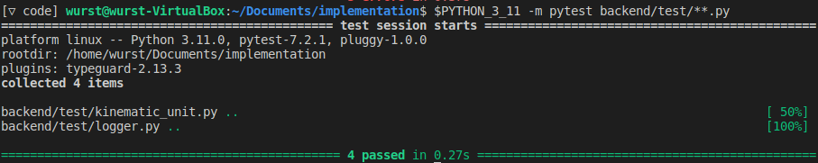

# Backend

The armarest backend is written in python.

## Installation

1. Install axii and activate a workspace, if you haven't already
2. Install the requirements with `pip install -r requirements.txt` . Depending on your linux distribution, you might have to use pip3 instead of pip.
3. As described in ../README.md, generate the required python interfaces with ../compile-slice.sh

## Running

You need an environment variable named SECRET_SIGNING_KEY to use authentication.
Make sure it is set on production servers, or disable authentication for testing purposes.

To start armarest, run ``python -m backend`` in the ``implementation`` folder. Depending on your linux distribution, you might have to use python3 instead of python.

You can also start a testserver for testing the frontend with ``python3 -m backend.launchtestserver``, which should not require armarx to be installed or running on your system.
Note that this testing server can only provide example data.

For testing purposes, you can also disable authentication with the ``--no-auth`` command-line argument.
This works on the main and the testing server.

To run the unit tests, run ``pytest test/**.py`` in the backend folder.

